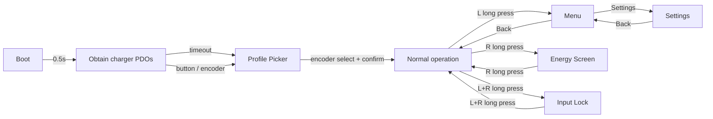
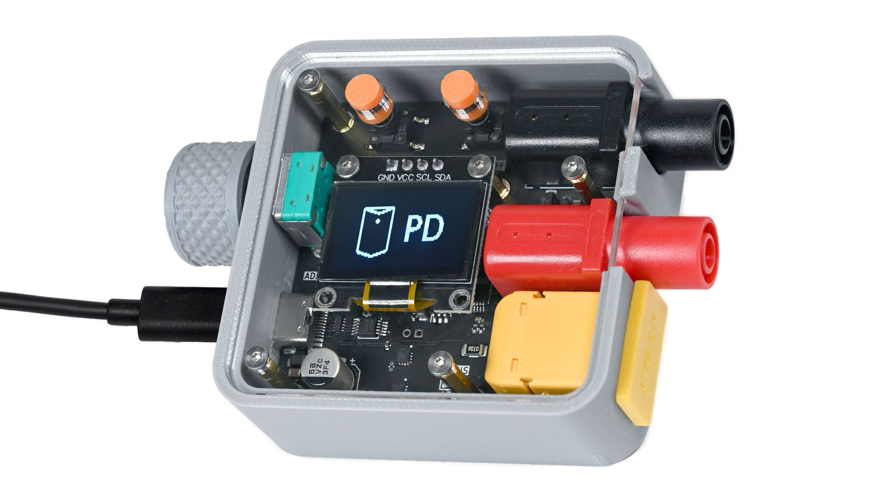

# PocketPD

[](https://github.com/braamBeresford/PocketPD/actions/workflows/main.yml)

PocketPD turns any PPS-capable USB-C charger into a pocket-sized bench
power supply, with a rotary encoder and two interface buttons for precise
V/I control and monitoring.

Physical knobs and buttons only; no Wi-Fi, no Bluetooth, no touchscreen.
Simple, reliable, works when you need it.

| Feature | Details |
|---|---|
| **Protocol** | USB-C Power Delivery 3.0 / 3.1 with PPS |
| **Voltage** | Adjustable within charger PPS range |
| **Current** | Adjustable within charger PPS range |
| **Controls** | Rotary encoder + two buttons (V/A, On/Off) |
| **Display** | OLED — voltage, current, power, energy |
| **Profiles** | PPS (variable) and fixed PDO selection |
| **Cable comp** | IR-drop compensation holds voltage at the load |
| **Input lock** | L+R long-press freezes all controls |
| **MCU** | RP2040 (Raspberry Pi Pico) |
| **Framework** | Arduino (earlephilhower core) via PlatformIO |

## Links

* [PocketPD Project — Hackaday](https://hackaday.io/project/194295-pocketpd-usb-c-portable-bench-power-supply)
* [PocketPD Hardware — GitHub](https://github.com/CentyLab/PocketPD_HW)
* [Firmware Releases](https://github.com/CentyLab/PocketPD/releases)
* [Flashing Guide (Wiki)](https://github.com/CentyLab/PocketPD/wiki/How-to-upload-new-firmware-to-PocketPD)

---

## System flow chart



---

## Firmware compatibility

| Firmware Version | HW 1.0 (Limited) | HW 1.1 | HW 1.2 | HW 1.3 (CrowdSupply) |
|---|---|---|---|---|
| `0.8.0` | x | | | |
| `0.9.0` | x | | | |
| `0.9.5` | x | | | |
| `0.9.7` | x | x | x | x |
| `0.9.9` | x | x | x | x |
| `1.0.0` | x | x | x | x |
| `2.0.0` | x | x | x | x |
| `2.0.1` | x | x | x | x |
| `2.1.0` | x | x | x | x |

The main difference between HW 1.0 and later revisions is the sense
resistor change (10 mΩ → 5 mΩ), which affects the current reading scale.
HW 1.0 and HW 1.1 also lack the V_SENSE voltage divider, so on those
boards the firmware reads source-side voltage from the AP33772 instead of
a dedicated ADC channel. The v2 build picks the right source automatically
per board.

<p align="center" width="100%">
    
</p>

> HW 1.0 — the "Limited" edition. Retired due to mass-production constraints.

---

## Operation

<details>
<summary>Boot sequence, controls and screen modes</summary>

### Controls

| Control | Action | What it does |
|---|---|---|
| Knob | Rotate | Adjust the value you're editing (PPS only) |
| Knob | Tap | Cycle step size: coarse → medium → fine (PPS only) |
| L | Tap | Switch between voltage and current adjust (PPS only) |
| L | Hold | Open Menu |
| R | Tap | Turn output on / off |
| R | Hold | Open Energy screen |
| L + R | Hold | Lock / unlock all inputs |

Inside the menu, profile picker, and settings the knob drives navigation:
rotate to move the cursor, push to choose, hold L to go back.

### Boot sequence

The system displays the firmware version on startup.

<p align="center" width="100%">
    
</p>

Once negotiation finishes, the profile picker lists all published PDO
profiles from the charger. Fixed profiles show e.g. `PDO 5V 3A`; PPS
profiles show their adjustable range, like `PPS 3.3~21.0V 5A`.

<p align="center" width="100%">
    
</p>

Rotate the knob to highlight a profile, then push and hold to commit.
A charger with no PPS profile still works, but the adjustable power
supply feature is unavailable.

<p align="center" width="100%">
    
</p>

### Normal operation — PPS

The big numbers are live measurements. The target voltage and current sit
below each reading; a small underscore cursor marks which value is being
edited.

<p align="center" width="100%">
    
</p>

Tap L to move between volts and amps, push the knob to cycle step size
(volts: 1 V / 100 mV / 20 mV; amps: 1 A / 100 mA / 50 mA), then rotate
to set the value. Tap R to toggle the output on/off.

### Normal operation — Fixed

Fixed and passthrough profiles have nothing to adjust; the knob and L tap
do nothing. Only the rated voltage and current are shown.

<p align="center" width="100%">
    
</p>

### Energy screen

Hold R to open the energy screen. It shows power, live V/A, elapsed time,
watt-hours and amp-hours. Hold R again to go back. The counter accumulates
only while the output is on.

<p align="center" width="100%">
    
</p>

### Menu and settings

Hold L to open the menu.

* **Skip picker** — when enabled, PocketPD boots straight to the
  operating screen using the first 5 V profile instead of stopping at the
  picker.
* **Voltage comp** — when enabled, PocketPD watches the load-side voltage
  and raises the PPS request in 20 mV steps (up to 500 mV) to cancel the
  IR drop across cable and connectors. Active only while output is on and
  a PPS profile is selected; resets on output-off or profile change.

### Non-PD sources

Plug in a charger with no USB-PD profiles and PocketPD shows `Non-PD
Source`, then activates passthrough mode after a few seconds. It meters
the voltage and current flowing through to your load.

</details>

---

## Firmware under the hood

v2 is a rewrite of the original monolithic firmware. It runs on `tempo`,
a small cooperative scheduler and typed event bus built for this project
(lives in `lib/tempo/` with its own native tests).

The UI is a stack of stages, one per screen: boot, PD negotiation,
profile picker, operating, energy, menu, and settings. Periodic tasks run
alongside the stages and talk to them over the event bus.

Hardware sits behind interfaces — one each for the PD sink, power monitor,
display, output switch, and supply-voltage source. That split lets the
AP33772 and INA226 drivers and the stage logic build and run as unit tests
on a host machine:

```
pio test -e native
```

---

## Building from source

<details>
<summary>Toolchain setup and build instructions</summary>

### Prerequisites

* [PlatformIO CLI](https://docs.platformio.org/en/latest/core/installation/index.html)
  or [VS Code](https://code.visualstudio.com/download) with the
  [PlatformIO extension](https://docs.platformio.org/en/latest/integration/ide/vscode.html#installation)

> **Windows users:** before the first build, follow
> [Important steps for Windows users, before installing](https://arduino-pico.readthedocs.io/en/latest/platformio.html#important-steps-for-windows-users-before-installing).
> Otherwise you will hit:
> ```
> VCSBaseException: VCS: Could not process command ['git', 'clone', '--recursive', ...]
> ```

### Build

```
make build-all
```

This builds `.uf2` files for all supported HW versions. Output goes to
the `dist/` folder.

</details>

---

## Flashing firmware

<details>
<summary>Step-by-step flashing instructions for macOS, Windows and Linux</summary>

> Firmware `0.9.5` and earlier is for **HW 1.0 only**.

### Step 1 — Download

Pick the correct `.uf2` from
[Firmware Releases](https://github.com/CentyLab/PocketPD/releases):

| Hardware | File |
|---|---|
| HW 1.0 ("Limited") | `PocketPD_HW1_0-v2.1.0.uf2` |
| HW 1.1+ / CrowdSupply | `PocketPD_HW1_3-v2.1.0.uf2` |

If building from source, the `.uf2` is in `dist/`.

### Step 2 — Enter bootloader (mount as `RPI-RP2` drive)

> **If PocketPD doesn't show up as a drive, connect it through any USB
> hub (USB 2 or USB 3).** See [Issue #23](https://github.com/CentyLab/PocketPD/issues/23).

#### macOS

* **Easy** — Short BOOT pads (HW 1.0) or hold the BOOT button (HW 1.1+).
  Connect via USB-A → USB-C adapter + cable. `RPI-RP2` drive appears.
* **Intermediate** — Connect first, then open a serial port at 1200 baud.
  `RPI-RP2` drive appears.

#### Windows

* **Easy** — Short BOOT pads / hold BOOT button, then connect via USB.
  `RPI-RP2` drive appears.
* **Intermediate** — Connect first, then open a serial port at 1200 baud
  with [PuTTY](https://www.putty.org/). `RPI-RP2` drive appears.

#### Linux

* **Easy** — Short BOOT pads / hold BOOT button, then connect via USB.
  The device enumerates as mass storage (`RPI-RP2`). Most desktops
  auto-mount it; otherwise: `sudo mount /dev/sdX1 /mnt`.
* **Intermediate** — Connect first, then touch the serial port at 1200
  baud (e.g. `picocom -b 1200 /dev/ttyACM0` or
  `stty -F /dev/ttyACM0 1200`). The device re-enumerates as `RPI-RP2`.

### Step 3 — Flash

Drag and drop the `.uf2` file into the `RPI-RP2` drive. The device
reboots into the new firmware on its own.

See also: [How to upload new firmware to PocketPD (Wiki)](https://github.com/CentyLab/PocketPD/wiki/How-to-upload-new-firmware-to-PocketPD)

</details>

---

## License

This project is licensed under the MIT License — see the [LICENSE](LICENSE)
file for details.
