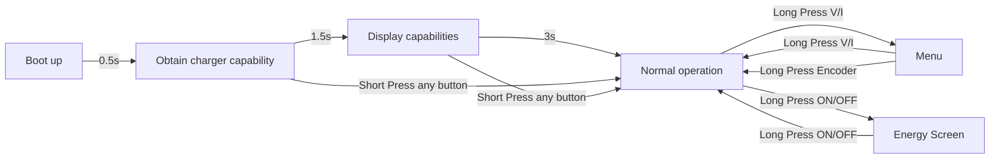

# PocketPD

[](https://github.com/braamBeresford/PocketPD/actions/workflows/main.yml)

A portable USB-C bench power supply that fits in your pocket.

Pair it with any USB-C PD 3.0/3.1 charger that supports PPS and you get
adjustable voltage and current — no wall-wart brick, no banana jacks,
just one cable. Physical knobs and buttons only; no Wi-Fi, no Bluetooth,
no touchscreen. Simple, reliable, works when you need it.

| Feature | Details |
|---|---|
| **Protocol** | USB-C Power Delivery 3.0 / 3.1 with PPS |
| **Voltage** | Adjustable within charger PPS range |
| **Current** | Adjustable within charger PPS range |
| **Controls** | Rotary encoder + two buttons (V/A, On/Off) |
| **Display** | OLED — voltage, current, power, energy |
| **Profiles** | PPS (variable) and fixed PDO selection |
| **MCU** | RP2040 (Raspberry Pi Pico) |
| **Framework** | Arduino (earlephilhower core) via PlatformIO |

## Links

* [PocketPD Project — Hackaday](https://hackaday.io/project/194295-pocketpd-usb-c-portable-bench-power-supply)
* [PocketPD Hardware — GitHub](https://github.com/CentyLab/PocketPD_HW)
* [Firmware Releases](https://github.com/CentyLab/PocketPD/releases)
* [Flashing Guide (Wiki)](https://github.com/CentyLab/PocketPD/wiki/How-to-upload-new-firmware-to-PocketPD)

---

## System flow chart



---

## Firmware compatibility

| Firmware Version | HW 1.0 (Limited) | HW 1.1 | HW 1.2 | HW 1.3 (CrowdSupply) |
|---|---|---|---|---|
| `0.8.0` | x | | | |
| `0.9.0` | x | | | |
| `0.9.5` | x | | | |
| `0.9.7` | x | x | x | x |
| `0.9.9` | x | x | x | x |
| `1.0.0` | x | x | x | x |

The main difference between HW 1.0 and later revisions is the sense
resistor change (10 mΩ → 5 mΩ), which affects the current reading scale.
HW 1.1+ changes are mainly connector and component rearrangement.

<p align="center" width="100%">
    
</p>

> HW 1.0 — the "Limited" edition. Retired due to mass-production constraints.

---

## Operation

<details>
<summary>Boot sequence, controls and screen modes</summary>

### Boot sequence

The system displays the firmware version on startup.

<p align="center" width="100%">
    
</p>

It then shows the available profiles from the charger. **A PPS profile is
required** for full bench-supply functionality. If your charger does not
support PPS, see [Non-PPS chargers](#non-pps-chargers) below.

<p align="center" width="100%">
    
</p>

After 3 seconds the system enters operating mode. With PPS available it
requests 5 V @ 1 A by default.

<p align="center" width="100%">
    
</p>

To select a different profile, hold the V/A button for 3 s to enter the
MENU screen.

### Skip boot screen

While still on the boot screen:

* Press any **button** → skip to NORMAL (operating screen)
* Rotate the **encoder** → skip to MENU (profile selection)
  * Turn to select profile, long-press encoder to activate

<p align="center" width="100%">
<video src="https://github.com/user-attachments/assets/563d36e5-1c92-49e6-aa88-c873a20ddf1d" width="80%" controls></video>
</p>

### Normal operation

| Input | Action |
|---|---|
| Rotate encoder | Increase / decrease voltage or current |
| Short press encoder | Toggle fine ↔ coarse increment |
| Short press V/A button | Switch between voltage and current adjust |
| Long press V/A button | Enter MENU screen |
| Short press On/Off button | Enable / disable output |
| Long press On/Off button | Enter ENERGY screen |

<p align="center" width="100%">
<video src="https://github.com/user-attachments/assets/1aa5be08-7ff9-443c-b3c7-ea3d54f766d1" width="80%" controls></video>
</p>

<p align="center" width="100%">
<video src="https://github.com/user-attachments/assets/d8f55b10-d94f-4dc2-9a7f-f5e726f47ec9" width="80%" controls></video>
</p>

<p align="center" width="100%">
<video src="https://github.com/user-attachments/assets/7a1174bd-7ffe-4ea3-8e91-18dc4e83c6fd" width="80%" controls></video>
</p>

### Menu screen

<p align="center" width="100%">
    
</p>

### Energy screen

<p align="center" width="100%">
    
</p>

### Fixed PDO profile (example: 15 V @ 3 A)

<p align="center" width="100%">
    
</p>

### Non-PPS chargers

If your charger lacks a PPS profile, PocketPD boots directly into the
first 5 V fixed PDO. The menu will look like this:

<p align="center" width="100%">
    
</p>

</details>

---

## Building from source

<details>
<summary>Toolchain setup and build instructions</summary>

### Prerequisites

* [VS Code](https://code.visualstudio.com/download) with the
  [PlatformIO extension](https://docs.platformio.org/en/latest/integration/ide/vscode.html#installation)

> **Windows users:** before the first build, follow
> [Important steps for Windows users, before installing](https://arduino-pico.readthedocs.io/en/latest/platformio.html#important-steps-for-windows-users-before-installing).
> Otherwise you will hit:
> ```
> VCSBaseException: VCS: Could not process command ['git', 'clone', '--recursive', ...]
> ```

### Build

1. Open PlatformIO → select the env matching your hardware (`HW1_0` or `HW1_1`)
2. Click **General → Build**
3. Output: `.pio/build/HW1_0/` or `.pio/build/HW1_1/`

</details>

---

## Flashing firmware

<details>
<summary>Step-by-step flashing instructions for macOS, Windows and Linux</summary>

> Firmware `0.9.5` and earlier is for **HW 1.0 only**.

### Step 1 — Download

Pick the correct `.uf2` from
[Firmware Releases](https://github.com/CentyLab/PocketPD/releases):

| Hardware | File |
|---|---|
| HW 1.0 ("Limited") | `firmware_xx_HW1.0.uf2` |
| HW 1.1+ | `firmware_xx_HW1.1.uf2` |

If building from source, the `.uf2` is in `.pio/build/HW1_0/` or `.pio/build/HW1_1/`.

### Step 2 — Enter bootloader (mount as `RPI-RP2` drive)

#### macOS

* **Easy** — Short BOOT pads (HW 1.0) or hold the BOOT button (HW 1.1+).
  Connect via USB-A → USB-C adapter + cable. `RPI-RP2` drive appears.
* **Intermediate** — Connect first, then open a serial port at 1200 baud.
  `RPI-RP2` drive appears.

#### Windows

* **Easy** — Short BOOT pads / hold BOOT button, then connect via USB.
  `RPI-RP2` drive appears.
* **Intermediate** — Connect first, then open a serial port at 1200 baud
  with [PuTTY](https://www.putty.org/). `RPI-RP2` drive appears.

#### Linux

* **Easy** — Short BOOT pads / hold BOOT button, then connect via USB.
  The device enumerates as mass storage (`RPI-RP2`). Most desktops
  auto-mount it; otherwise: `sudo mount /dev/sdX1 /mnt`.
* **Intermediate** — Connect first, then touch the serial port at 1200
  baud (e.g. `picocom -b 1200 /dev/ttyACM0` or
  `stty -F /dev/ttyACM0 1200`). The device re-enumerates as `RPI-RP2`.

### Step 3 — Flash

Drag and drop the `.uf2` file into the `RPI-RP2` drive.

See also: [How to upload new firmware to PocketPD (Wiki)](https://github.com/CentyLab/PocketPD/wiki/How-to-upload-new-firmware-to-PocketPD)

</details>

---

## License

This project is licensed under the MIT License — see the [LICENSE](LICENSE)
file for details.
